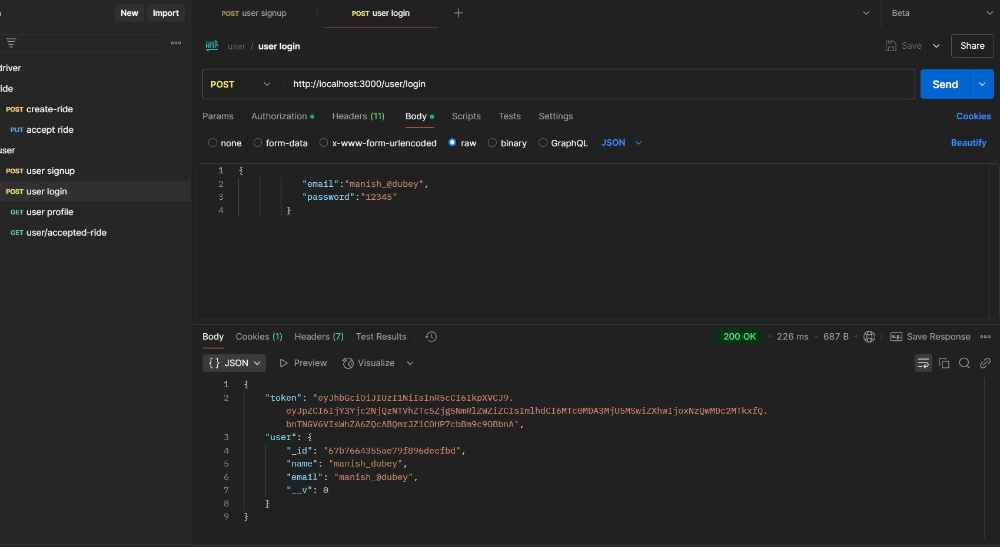

# Uber Backend (Microservices, Node.js, Express, MongoDB)

## Overview 

 
- Designed and implemented a scalable microservices-based backend for a ride-booking system.  
- Developed Ride Service and Accept Service for seamless ride creation and acceptance.  
- Integrated JWT authentication for secure user and captain login/signup.  
- Implemented captain availability toggling and service communication using RabbitMQ. 

  
